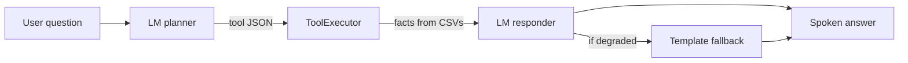
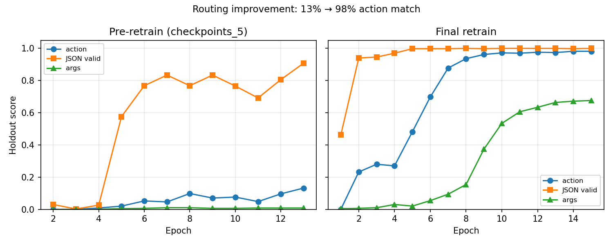
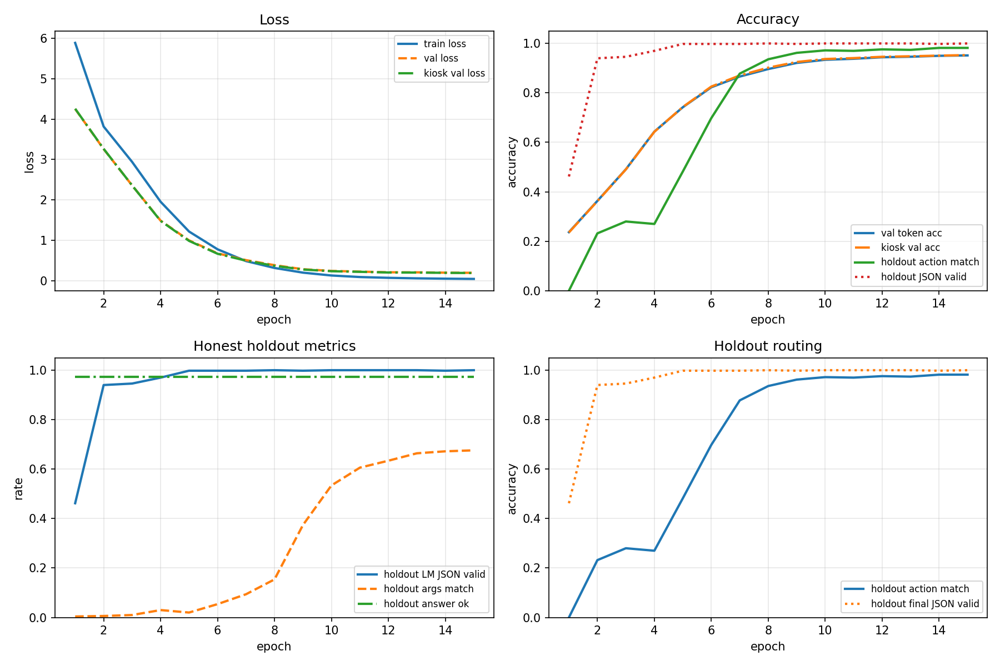
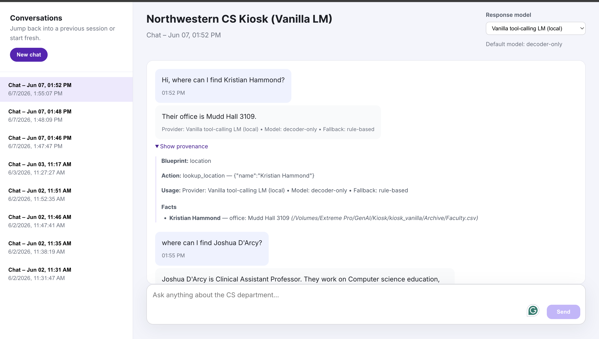

# Northwestern CS Kiosk — Vanilla Tool-Calling LM

Decoder-only Transformer that powers a **Northwestern CS department kiosk**: the model picks a tool (JSON), Python executes it against CSV archives, then the model (or a template fallback) speaks a short grounded answer.

**~41M parameters** · 12 layers · d_model 512 · trained on Quest H100 · deployed via [Hugging Face Space](https://huggingface.co/spaces/monish563/kiosk_vanilla)

---

## 1. Overview



| Component | Role |
|-----------|------|
| **Planner** | Generates `{"action": ..., "arguments": ...}` |
| **Executor** | Runs kiosk tools on `Archive/` faculty, hours, locations |
| **Responder** | Generates natural-language answer from facts |
| **Fallback** | Template answer when LM prose is degraded but routing succeeded |

No separate action classifier — tool routing is ordinary causal language modeling over JSON.

---

## 2. Installation & run

### Dependencies

```bash
cd MSAI_Text_Generation
python -m venv .venv && source .venv/bin/activate
pip install -r requirements.txt
```

Requires sibling repo [`kiosk_vanilla/`](../kiosk_vanilla/) (UI + Archive CSVs).

### Smoke test (local)

```bash
python scripts/kiosk_demo.py \
  --checkpoint checkpoints/best.pt \
  --kiosk-root ../kiosk_vanilla \
  --archive ../kiosk_vanilla/Archive \
  --question "Hi, where can I find Kristian Hammond?"
```

### Full pipeline (laptop → Quest)

| Step | Command |
|------|---------|
| Synthetic data | `python scripts/generate_synthetic.py --config configs/train_retrain.yaml` |
| Preprocess | `python scripts/preprocess.py --config configs/train_retrain.yaml` |
| Tokenizer | `python scripts/train_tokenizer.py --config configs/train_retrain.yaml` |
| Train (Quest GPU) | `python scripts/train.py --config configs/train_retrain.yaml` |
| Eval | `python scripts/eval.py --checkpoint checkpoints/best.pt` |

On Quest: rsync this repo to the cluster, activate the venv, then run the train step with `configs/train_retrain.yaml`. Copy `checkpoints/best.pt` and `tokenizer/` back when done.

### Chatbot GUI

```bash
cd ../kiosk_vanilla
pip install -r requirements.txt
python -m uvicorn backend.main:app --port 8010
```

Live demo: [huggingface.co/spaces/monish563/kiosk_vanilla](https://huggingface.co/spaces/monish563/kiosk_vanilla)

---

## 3. Results

### Training results

| Metric | Score |
|--------|------:|
| Action match | **0.982** |
| LM JSON valid | **1.000** |
| Args match | **0.676** |
| Answer nonempty | 0.974 |

Final retrain (epoch 15) improved action match from ~13% to ~98% while JSON validity reached 1.0.





### Output

Tool routing is strong (98.2% holdout action match): the model picks real kiosk tools instead of the pre-retrain `noop` failures. When routing succeeds, provenance shows the correct action, args, and CSV-backed facts. The remaining weakness is **answer text generation** — LM prose is often degraded, so a template fallback produces the readable reply users see today; improving that channel is future work (see [journal Phase 6](docs/ENGINEERING_JOURNAL.md#phase-6--inference-quality-post-train)).



Wrong-tool example and pre-retrain terminal demo: [`docs/ENGINEERING_JOURNAL.md`](docs/ENGINEERING_JOURNAL.md).

---

## 4. Extra criteria pursued

**Chatbot GUI** — full React chat UI with session history, provenance panel (tool action, facts, fallback flag), and local vanilla LM backend. Deployed as a Docker Hugging Face Space.

**MCP-style tool calling** — the kiosk backend (`kiosk_vanilla/backend/mcp/`) implements a Model Context Protocol–inspired planner → executor loop without a cloud API: the vanilla LM emits structured JSON, Python runs the tool, then the LM (or template fallback) answers from grounded facts.

1. **Planner** (`VanillaLMPlanner`) — causal LM generates `{"action": "...", "arguments": {...}}` against schemas in `tool_schemas.py` (same definitions used for training and eval).
2. **Executor** (`ToolExecutor`) — dispatches the action to `AnalysisEngine` blueprints over `Archive/` CSVs (faculty, staff, students, office hours, events).
3. **Responder** (`VanillaLMResponder`) — turns tool facts into spoken prose; template fallback when LM output is degraded.

| Tool | What it does |
|------|----------------|
| `lookup_location` | Office or seating for a named person |
| `lookup_person` | Merged faculty / staff / student profile |
| `lookup_faculty_topic` | Faculty whose research matches a topic |
| `lookup_center` | Research centers by faculty or center name |
| `lookup_advisorship` | Advisor ↔ advisee relationships |
| `lookup_office_hours` | Hours by course, person, or day |
| `lookup_staff_support` | Staff contact for an admin need |
| `list_events` | Upcoming CS events (optional keyword filter) |

Multi-turn follow-ups use `PlannerContext` (`use_last_subject`, topic/subject tracking) and `context_resolver.enrich_action_from_question()` to repair args when the LM routes correctly but omits a name. Synthetic training data is generated by running this same executor against real kiosk archives — so holdout metrics measure end-to-end tool routing, not JSON syntax alone.

---

## 5. Difficulties & how we solved them

| Problem | Solution |
|---------|----------|
| Val loss stuck at 0 | Fixed assistant span label masking (char-prefix boundaries) |
| Action head / LoRA dead ends | Removed action head; vanilla LM JSON generation only |
| 13% action match, valid JSON | Rich system prompt, seq_len 2048, rebalanced data, `holdout_action_acc` checkpoint metric |
| Garbled answers (`Ġ`, repetition) | ByteLevel tokenizer decode + gated template fallback |
| UI routing regression | Removed inference-time entity name list from system prompt |

Full timeline with figures: [`docs/ENGINEERING_JOURNAL.md`](docs/ENGINEERING_JOURNAL.md)

---

## Repository layout

```
MSAI_Text_Generation/
  configs/train_retrain.yaml   # primary training config
  scripts/                     # generate, preprocess, train, eval, demo
  src/                         # model, training, inference, synthetic data
  assets/                      # README figures
  docs/                        # engineering journal
  checkpoints/best.pt          # gitignored — copy from Quest after training
  tokenizer/                   # gitignored — must match best.pt vocab (4951)
  data/processed/              # gitignored — kiosk train/val/holdout JSONL
```
