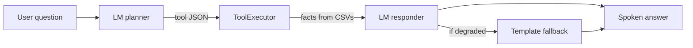
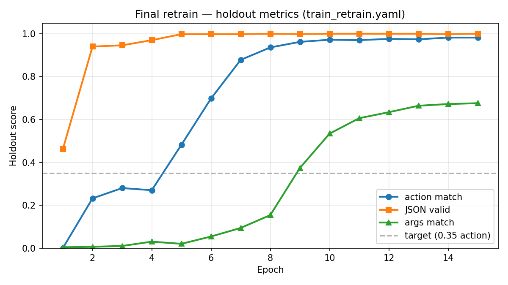

# Northwestern CS Kiosk — Vanilla Tool-Calling LM

Decoder-only Transformer that powers a **Northwestern CS department kiosk**: the model picks a tool (JSON), Python executes it against CSV archives, then the model (or a template fallback) speaks a short grounded answer.

**~41M parameters** · 12 layers · d_model 512 · trained on Quest H100 · deployed via [Hugging Face Space](https://huggingface.co/spaces/monish563/kiosk_vanilla)

---

## 1. Overview



| Component | Role |
|-----------|------|
| **Planner** | Generates `{"action": ..., "arguments": ...}` |
| **Executor** | Runs kiosk tools on `Archive/` faculty, hours, locations |
| **Responder** | Generates natural-language answer from facts |
| **Fallback** | Template answer when LM prose is degraded but routing succeeded |

No separate action classifier — tool routing is ordinary causal language modeling over JSON.

---

## 2. Installation & run

### Dependencies

```bash
cd MSAI_Text_Generation
python -m venv .venv && source .venv/bin/activate
pip install -r requirements.txt
```

Requires sibling repo [`kiosk_vanilla/`](../kiosk_vanilla/) (UI + Archive CSVs).

### Smoke test (local)

```bash
python scripts/kiosk_demo.py \
  --checkpoint checkpoints/best.pt \
  --kiosk-root ../kiosk_vanilla \
  --archive ../kiosk_vanilla/Archive \
  --question "Hi, where can I find Kristian Hammond?"
```

### Full pipeline (laptop → Quest)

| Step | Command |
|------|---------|
| Synthetic data | `python scripts/generate_synthetic.py --config configs/train_retrain.yaml` |
| Preprocess | `python scripts/preprocess.py --config configs/train_retrain.yaml` |
| Tokenizer | `python scripts/train_tokenizer.py --config configs/train_retrain.yaml` |
| Train (Quest GPU) | `python scripts/train.py --config configs/train_retrain.yaml` |
| Eval | `python scripts/eval.py --checkpoint checkpoints/best.pt` |

See [`docs/RETRAIN_VANILLA.md`](docs/RETRAIN_VANILLA.md) for rsync and Quest details.

### Chatbot GUI

```bash
cd ../kiosk_vanilla
pip install -r requirements.txt
python -m uvicorn backend.main:app --port 8010
```

Live demo: [huggingface.co/spaces/monish563/kiosk_vanilla](https://huggingface.co/spaces/monish563/kiosk_vanilla)

---

## 3. Results

### Final holdout metrics (epoch 15)

| Metric | Score |
|--------|------:|
| Action match | **0.982** |
| LM JSON valid | **1.000** |
| Args match | **0.676** |
| Answer nonempty | 0.974 |




### Output

| | Pre-retrain | Final |
|---|------------:|------:|
| holdout_action_match | 0.13 | **0.98** |
| Routing | noop / wrong tool | correct tool + name |
| Answer quality | garbled / `Ġ` tokens | clean (template fallback when needed) |


---

## 4. Extra criteria pursued

**Chatbot GUI** — full React chat UI with session history, provenance panel (tool action, facts, fallback flag), and local vanilla LM backend. Deployed as a Docker Hugging Face Space.

---

## 5. Difficulties & how we solved them

| Problem | Solution |
|---------|----------|
| Val loss stuck at 0 | Fixed assistant span label masking (char-prefix boundaries) |
| Action head / LoRA dead ends | Removed action head; vanilla LM JSON generation only |
| 13% action match, valid JSON | Rich system prompt, seq_len 2048, rebalanced data, `holdout_action_acc` checkpoint metric |
| Garbled answers (`Ġ`, repetition) | ByteLevel tokenizer decode + gated template fallback |
| UI routing regression | Removed inference-time entity name list from system prompt |
| Quest resume crash | Move optimizer state to GPU after `model.to(device)` |

Full timeline with figures: [`docs/ENGINEERING_JOURNAL.md`](docs/ENGINEERING_JOURNAL.md)

---

## Repository layout

```
MSAI_Text_Generation/
  configs/train_retrain.yaml   # primary training config
  scripts/                     # generate, preprocess, train, eval, demo
  src/                         # model, training, inference, synthetic data
  assets/                      # README figures
  docs/                        # engineering journal + retrain runbook
  checkpoints/best.pt          # gitignored — copy from Quest after training
  tokenizer/                   # gitignored — must match best.pt vocab (4951)
  data/processed/              # gitignored — kiosk train/val/holdout JSONL
```

Additional figures (checkpoint comparisons, terminal demos, GUI screenshots) are in [`docs/ENGINEERING_JOURNAL.md`](docs/ENGINEERING_JOURNAL.md).
