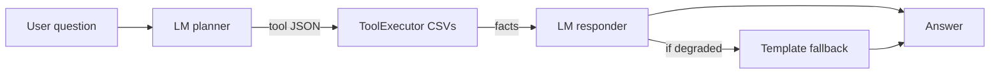
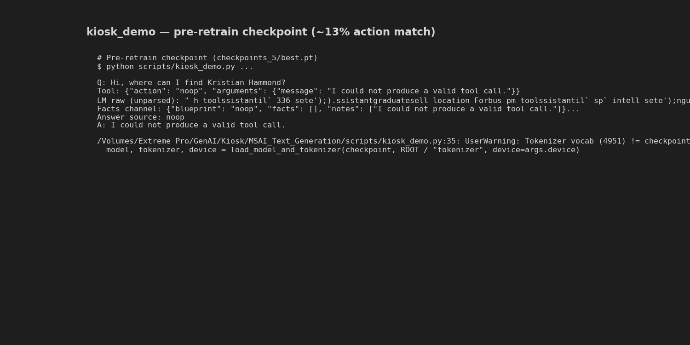
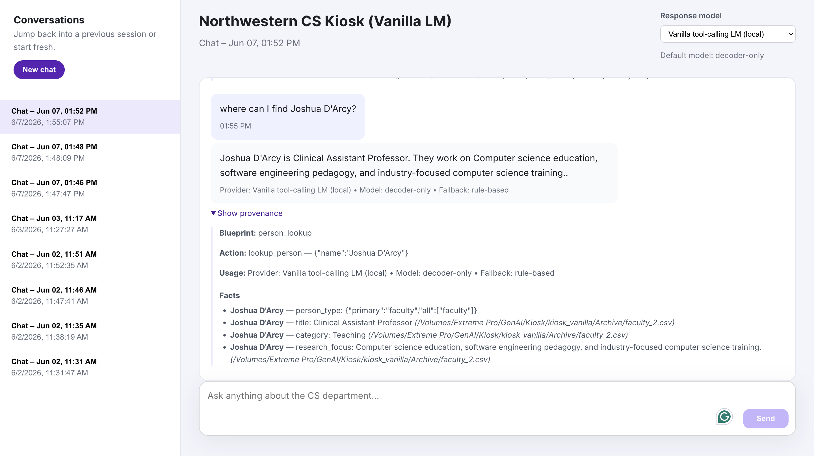

# Engineering Journal — Northwestern CS Kiosk LM

Development log for the vanilla decoder-only tool-calling language model (May–Jun 2026).  
35 git commits; final checkpoint trained on Quest H100 with `configs/train_retrain.yaml`.

---

## Architecture (final)



- **Model:** 12-layer decoder-only Transformer, d_model=512, ~41M parameters
- **No action classifier head** — tool routing is next-token JSON generation
- **Training data:** synthetic kiosk JSONL from real `ToolExecutor` + `render_answer()`
- **UI:** React chat in `kiosk_vanilla/`, deployed as Hugging Face Docker Space

---

## Metrics progression (final retrain)

| Epoch | train_loss | holdout_action_match | holdout_lm_json_valid | holdout_args_match |
|------:|-----------:|---------------------:|----------------------:|-------------------:|
| 1 | 5.88 | 0.000 | 0.462 | 0.004 |
| 5 | 1.22 | 0.482 | 0.998 | 0.020 |
| 8 | 0.32 | 0.936 | 1.000 | 0.154 |
| 12 | 0.08 | 0.976 | 1.000 | 0.634 |
| **15** | **0.05** | **0.982** | **1.000** | **0.676** |

Source: `checkpoints/metrics.csv` (best checkpoint selected by `holdout_action_acc`).

**Baseline comparison** — pre-retrain run archived at `../checkpoints/checkpoints_5/`:

| Run | Final epoch | holdout_action_match | holdout_lm_json_valid |
|-----|------------:|---------------------:|----------------------:|
| checkpoints_5 (Jun 2) | 13 | **0.132** | 0.908 |
| Final retrain (Jun 7) | 15 | **0.982** | 1.000 |

The old run learned valid JSON shells but routed to wrong tools (office-hours collapse, CS-211 topic bleed).

Training curves and holdout comparison: see [README §3](../README.md#3-results).

---

## Phase 1 — Bootstrap (May 14–19)

**Commits:** `Initial commit`, `added synethetic gen`, `added metrics tracking`

Built the end-to-end pipeline:

1. `generate_synthetic.py` — runs real kiosk `ToolExecutor` against `Archive/` CSVs
2. `preprocess.py` — train/val/holdout split
3. `train.py` — LM-only training with holdout eval each epoch

**Design choice:** bake tool results and gold answers into training text so Quest training needs no live kiosk repo.

---

## Phase 2 — Training pipeline bugs (May 30–31)

**Commits:** `fixed 0 loss issue`, `fixed windows num workers`, `fixed kiosk loss`, `Fix kiosk label masking via char-prefix token boundaries on Windows`, `holdout fix` (×3), `fixed training problems`

### Failure: validation loss stuck at 0

The model appeared to learn nothing — val loss flatlined because label masking zeroed out assistant spans incorrectly on Windows token boundaries.

### Fix

Char-prefix token boundary alignment in `format.py` so loss is computed only on assistant JSON and answer tokens.

### Failure: holdout set leakage / wrong splits

Holdout metrics were unreliable for early stopping.

### Fix

Three incremental holdout fixes; holdout shard frozen at 500 examples.

### Evidence (epoch 1 holdout failures)

```json
{"question": "Where can I find Xinyu Xing?", "expected_action": "lookup_location",
 "got_action": "lookup_", "lm_text": "{\"action\":\"lookup_\",\"arguments\":{\"name\":\"_\"}}"}
```

Malformed partial tool names (`lookup_`) and empty JSON keys.

---

## Phase 3 — Architecture experiments (May 31 – Jun 1)

**Commits:** `added aux loss for making better tool calls`, `removed attention head for action`, `lora fix`, `embedding mismatch fix`, `model saving to avoid disk error`

### Failure: auxiliary action classifier head

A separate action head was added to bias tool selection. It did not improve holdout routing and complicated checkpoint loading.

### Fix

**Removed action head** (`0cd92e1`). Tool choice is pure causal LM over JSON text — simpler and ultimately more successful.

### Failure: LoRA fine-tune path

LoRA adapters trained on a HF base model (`../checkpoints/checkpoints_4/`) did not integrate cleanly with the kiosk agent format.

### Fix

Abandoned LoRA for this project; continued with full fine-tune of vanilla Transformer from scratch on kiosk synthetic data only.

### Failure: Quest disk full during checkpoint save

### Fix

Split `best.pt` / `last.pt` saving logic to avoid writing redundant full optimizer state every epoch.

---

## Phase 4 — Mode collapse (early June, checkpoints_5)

**Symptoms:**

- `holdout_action_match` peaked at **13.2%** at epoch 13
- `holdout_lm_json_valid` reached **90.8%** — model learned JSON syntax without correct routing
- Demo answers showed CS-211 / Subrahmanian repetition (wrong tool context bleed)
- Terminal demo often returned `noop` with garbled raw LM text

**Previous results** — pre-retrain checkpoint (`checkpoints_5/best.pt`, ~13% action match): the model failed to emit any valid tool call — `noop` with garbled raw LM text — unlike the current model which reliably routes to a kiosk tool.



**Root causes identified:**

1. **Compact system prompt** truncated tool descriptions at `max_seq_len=1024`
2. **`ACTION_WEIGHTS`** over-sampled `lookup_office_hours` and `noop`
3. **`best.pt` selected by val loss**, not routing accuracy — JSON-valid but wrong-action checkpoints were saved

---

## Phase 5 — Retrain that worked (Jun 2–7)

**Commits:** `change seq len`, `change data mix`, `train fix to account for prompt`, `retrain for text gen`, `device error`

### Changes (`configs/train_retrain.yaml`)

| Change | Before | After |
|--------|--------|-------|
| `max_seq_len` | 1024 | **2048** |
| `system_style` | compact | **rich** (full tool docs) |
| `ACTION_WEIGHTS` | office-hours heavy | more person/location |
| `best_checkpoint_metric` | val loss | **holdout_action_acc** |
| Synthetic data | old templates | apostrophe names, topic-switch multi-turn |
| `multi_turn_ratio` | 0.22 | **0.28** |

### Result

Epoch 12 already exceeded targets (`holdout_action_match ≈ 0.98`). Training continued to epoch 15; args match still improving (0.63 → 0.68).

### Failure: resume crash on Quest

`--resume checkpoints/last.pt` failed with `cuda:0` vs `cpu` optimizer state mismatch.

### Fix (`e76892b`)

`_move_optimizer_to_device()` after `model.to(device)` in `train_loop.py`.

### Remaining failure modes (epoch 15 holdout)

Most errors are **topic routing** confusion, not JSON syntax:

```json
{"expected_action": "lookup_faculty_topic", "got_action": "lookup_staff_support",
 "question": "Who should I talk to about Game design and development?"}
```

Args match (67.6%) lags action match (98.2%) — faculty-topic vs staff-support boundary is the weak spot.

---

## Phase 6 — Inference quality (post-train)

Training metrics were strong but the deployed UI still showed bad answers. Issues were **inference-side**, not routing retrain.

### Failure: BPE decode artifacts (`Ġ` in output)

Tokenizer missing ByteLevel decoder at inference → raw SentencePiece tokens in answers.

### Fix

Attach `decoders.ByteLevel()` in `load_tokenizer()` and `train_tokenizer.py`.

### Failure: garbled LM answers despite correct routing

Model generated multi-turn training bleed (Subrahmanian repetition, leaked JSON in answer channel).

### Fix

`answer_quality.py` — `is_degraded_lm_output()` + gated `render_answer()` template fallback when routing succeeded and facts exist.

### Failure: UI routed to `use_last_subject` instead of extracting names

Injecting 368 entity names into the LM system prompt at inference shifted behavior away from training.

### Fix (in `kiosk_vanilla`)

Removed names from inference system prompt; added `enrich_action_from_question()` for arg repair.

### Evidence (current results)

Current UI: routing succeeds (correct action + facts in provenance) even when the LM’s spoken answer is still inconsistent — template fallback covers degraded prose. This is progress over the pre-retrain `noop` runs in Phase 4, though end-to-end LM generation is not yet reliable. See [README §3](../README.md#3-results) for a clean grounded example.



---

## Chatbot GUI (extra criteria)

Full React chat UI with session history and provenance panel (tool action, facts, fallback flag). Deployed as a Docker Hugging Face Space.

---

## Failure taxonomy

| Category | Symptom | Primary fix |
|----------|---------|-------------|
| Label masking | val loss = 0 | char-prefix boundaries |
| JSON syntax | `lookup_`, empty keys | longer training + rich prompt |
| Wrong action | valid JSON, wrong tool | action-weight rebalance + holdout_action_acc metric |
| Wrong args | correct tool, wrong name/topic | more synthetic templates; inference arg enrich |
| Answer garbage | correct facts, unreadable text | ByteLevel decode + template fallback |
| UI routing regression | `use_last_subject` on first turn | remove inference name list |

---

## Figure index

| File | Description | Where |
|------|-------------|-------|
| `training_curves.png` | Train/val loss and accuracy (Quest run) | [README §3](../README.md#3-results) |
| `metrics_comparison.png` | Pre-retrain (`checkpoints_5`) vs final retrain | [README §3](../README.md#3-results) |
| `Correct_output.png` | UI — grounded answer with correct tool routing | [README §3](../README.md#3-results) |
| `Wrong_output.png` | UI — routing works, LM answer still weak | Phase 6 |
| `bad_tool_json.png` | Pre-retrain terminal demo — noop, no valid tool call | Phase 4 |

## Key files

| File | Role |
|------|------|
| `configs/train_retrain.yaml` | Final training config |
| `checkpoints/best.pt` | Deployed weights (epoch 14–15 best action acc) |
| `checkpoints/metrics.csv` | Per-epoch metrics |
| `src/data/synthetic.py` | Synthetic data + ACTION_WEIGHTS |
| `src/inference/generate.py` | Tool + answer generation |
| `src/inference/answer_quality.py` | Degraded answer detection + fallback |
| `docs/RETRAIN_VANILLA.md` | Operational retrain runbook |
